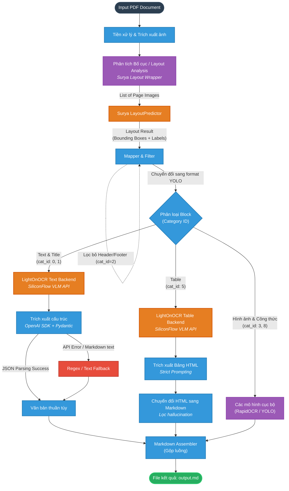

# V-Miner VLM Pipeline Architecture

Tài liệu này mô tả kiến trúc mới của **V-Miner**, sau khi tích hợp thành công mô hình Layout phân tích sâu từ **Surya OCR** và thay thế backend nhận diện truyền thống bằng **Vision-Language Model (VLM)** qua nền tảng SiliconFlow.

## Sơ đồ luồng xử lý (Mermaid Diagram)

Dưới đây là sơ đồ luồng hoạt động (Workflow) từ khi đọc file PDF cho đến khi xuất ra file Markdown.



## Các thay đổi & Nâng cấp cốt lõi

1. **Surya Layout Analysis (Marker Style):**
   - Thay thế DocLayout-YOLO bằng `surya-ocr` (`LayoutPredictor` + `FoundationPredictor`).
   - Sửa lỗi mapping ID để các label như `Table`, `Title`, `Text` tương thích 100% với luồng pipeline cũ của V-Miner.
   - Thêm bộ lọc (Filter) trực tiếp tại bước Layout để drop các block vô giá trị như `Page-header`, `Page-footer`.

2. **VLM Backend (LightOnOCR qua SiliconFlow):**
   - Thay thế cơ chế gọi API bằng thư viện `requests` thủ công sang **OpenAI Python SDK** chuẩn.
   - Sử dụng tính năng `response_format` của OpenAI SDK kết hợp với Pydantic Schemas để ép mô hình trả về JSON có cấu trúc cứng.
   - Bổ sung hệ thống Fallback 2 lớp: Nếu mô hình từ chối format JSON (trả về raw text hoặc bọc trong thẻ ````json`), hệ thống tự động chạy Regex để extract nội dung.

3. **Chống Ảo giác (Anti-Hallucination) cho Bảng biểu:**
   - Cập nhật System Prompts nghiêm ngặt, ngăn chặn VLM tự ý "thông minh" lặp lại các hậu tố không cần thiết (ví dụ: gộp tên bảng vào từng ô của header).
   - Thiết lập `temperature=0.0` trên toàn bộ các lời gọi API để đảm bảo tính nhất quán (Deterministic).

## Cách kích hoạt Pipeline mới

Cấu hình các biến môi trường sau trước khi chạy lệnh:

```bash
# 1. Cấu hình xác thực API (SiliconFlow / VLM)
export OPENAI_API_BASE="https://api.siliconflow.com/v1"
export OPENAI_API_KEY="sk-xxxxxxxxxxxxxxxxxxxxxxxx"
export OPENAI_MODEL="Qwen/Qwen3-VL-32B-Instruct"

# 2. Ép sử dụng VLM Backend
export MINERU_TEXT_BACKEND=lighton
export MINERU_TABLE_BACKEND=lighton
export MINERU_IMAGE_BACKEND=lighton

# 3. Ép sử dụng Surya Layout
export MINERU_LAYOUT_BACKEND=surya

# 4. Chạy lệnh
mineru -p input.pdf -o output_dir
```
